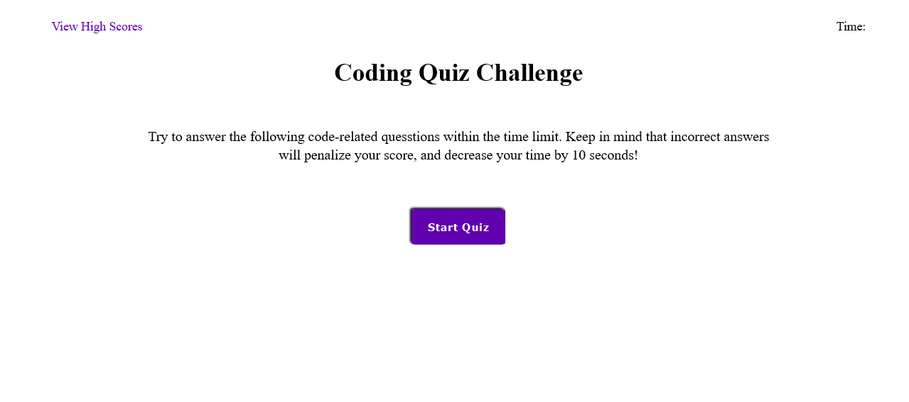

## Coding Quiz

# Description

This web application conatains HTML, CSS and JavaScript. This app will test your knowledge of coding and provide a score at the end of the quiz. The quiz provides a score at the end and you can keep playing to see how high you can get your score. This application taught me how to create and append elements with JavaScript, and taught me how to traverse through the DOM.

# Installation

To use the application simply click on the deployed link and it will take you to the quiz.

# Usage

To use the application simply click the start button, and it will take you through the 5 quiz questions. Each question has 4 answer choices, but only 1 is the correct answer. Each question is worth 10 points. This quiz is also timed, and if you guess a wrong answer you will lose 10 seconds of time. Click the "view high scores" link at the top left of the application to se all of the high scores in storage.

# Credits

https://github.com/CoreyDC/code-trivia-game

https://coreydc.github.io/code-trivia-game/
